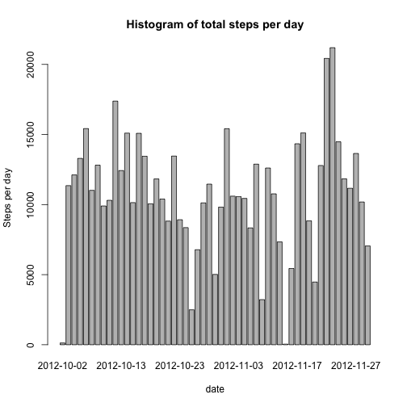
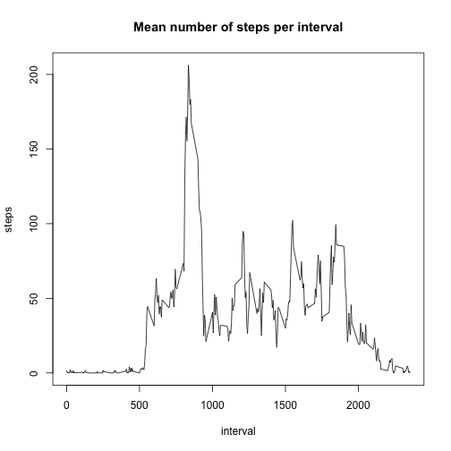
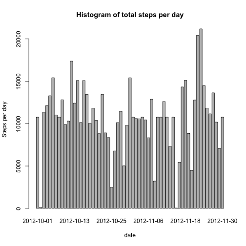
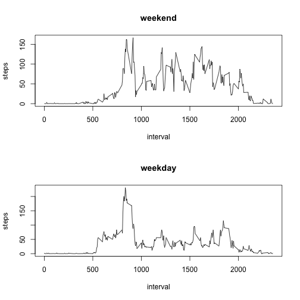

Reproducible Research: Peer Assessment 1
----------------------------------------
By Peter Maneykowski

## Loading and preprocessing the data

1. Load the data (i.e. `read.csv()`)


```r
df <- read.csv(unz('activity.zip', 'activity.csv'))
```


## What is mean total number of steps taken per day?

1. Make a histogram of the total number of steps taken each day


```r
df.bydate <- aggregate(steps ~ date, data=df, FUN=sum)
barplot(df.bydate$steps,
        names.arg=df.bydate$date,
        xlab='date',
        ylab='Steps per day',
        main='Histogram of total steps per day')
```

 

2. Calculate and report the **mean** and **median** total number of
   steps taken per day


```r
mean(df.bydate$steps)
```

```
## [1] 10766.19
```

```r
median(df.bydate$steps)
```

```
## [1] 10765
```


## What is the average daily activity pattern?

1. Make a time series plot (i.e. `type = "l"`) of the 5-minute interval
   (x-axis) and the average number of steps taken, averaged across all
   days (y-axis)


```r
df.byinterval <- aggregate(steps ~ interval, data=df, FUN=mean)
plot(df.byinterval,
     type='l',
     main='Mean number of steps per interval')
```

 

2. Which 5-minute interval, on average across all the days in the
   dataset, contains the maximum number of steps?


```r
df.byinterval$interval[which.max(df.byinterval$steps)]
```

```
## [1] 835
```


## Imputing missing values

1. Calculate and report the total number of missing values in the
   dataset (i.e. the total number of rows with `NA`s)


```r
sum(is.na(df))
```

```
## [1] 2304
```

2. Devise a strategy for filling in all of the missing values in the
   dataset. The strategy does not need to be sophisticated. For example,
   you could use the mean/median for that day, or the mean for that
   5-minute interval, etc.

I will use the mean of 5-minute intervals grouped by date to fill in
missing values.

3. Create a new dataset that is equal to the original dataset but with
   the missing data filled in.


```r
df2 <- merge(df, df.byinterval, by='interval', suffixes=c('', '.y'))
na.mask <- is.na(df2$steps)
df2$steps[na.mask] <- df2$steps.y[na.mask]
df2 <- df2[, c(1, 2, 3)]
```

4. Make a histogram of the total number of steps taken each day and
   calculate and report the **mean** and **median** total number of
   steps taken per day. Do these values differ from the estimates from
   the first part of the assignment? What is the impact of imputing
   missing data on the estimates of the total daily number of steps?


```r
df2.bydate <- aggregate(steps ~ date, data=df2, FUN=sum)
barplot(df2.bydate$steps,
        names.arg=df2.bydate$date,
        xlab='date',
        ylab='Steps per day',
        main='Histogram of total steps per day')
```

 

```r
mean(df2.bydate$steps)
```

```
## [1] 10766.19
```

```r
median(df2.bydate$steps)
```

```
## [1] 10766.19
```

Imputing the missing data does not seem to have much of an impact on
the bar plot. I would consider this to be a good thing because imputing
data could result in the study suggesting something that the real data
did not show.


## Are there differences in activity patterns between weekdays and weekends?

1. Create a new factor variable in the dataset with two levels --
   "weekday" and "weekend" indicating whether a given date is a weekday
   or weekend day.


```r
weekday <- function(x) {
  day <- as.POSIXlt(x)$wday
  if (day %in% c(0, 6)) {
    "weekend"
  }
  else {
    "weekday"
  }
}

df2$wday <- as.factor(sapply(df2$date, weekday))
```

2. Make a panel plot containing a time series plot (i.e. `type = "l"`)
   of the 5-minute interval (x-axis) and the average number of steps
   taken, averaged across all weekday days or weekend days (y-axis). The
   plot should look something like the following, which was created
   using **simulated data**:


```r
par(mfrow=c(2, 1))  # So plots stack
for (day in c('weekend', 'weekday')) {
  df2.bytype <- aggregate(steps ~ interval,
                          data=df2,
                          subset=df2$wday == day,
                          FUN=mean)
  plot(df2.bytype,
       type='l',
       main=day)
}
```

 
